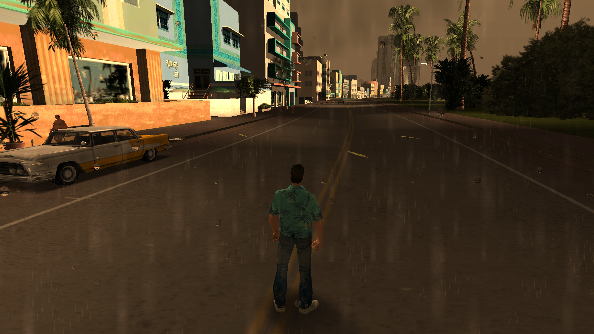
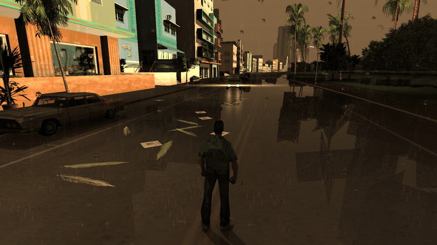
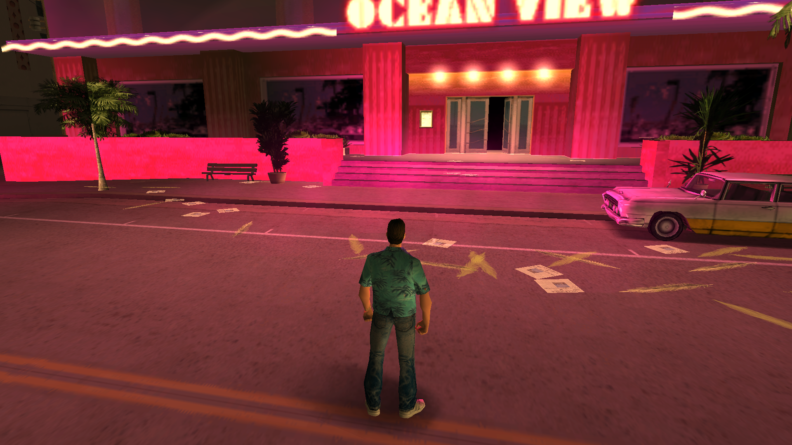
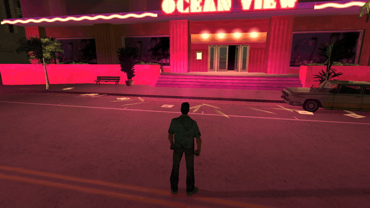
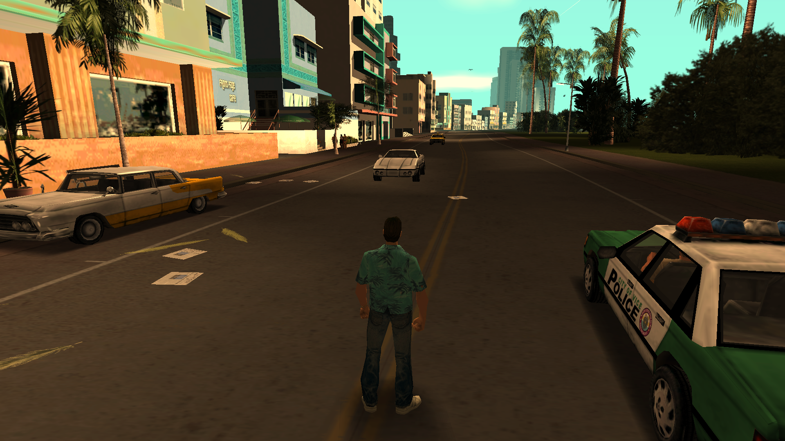
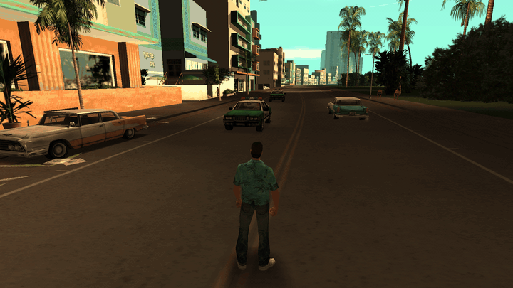
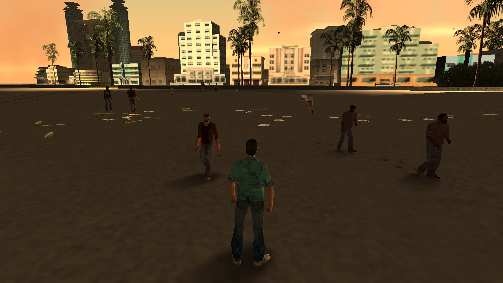
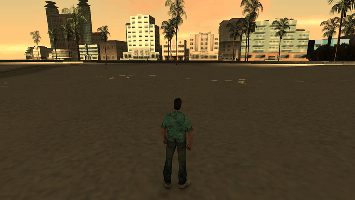
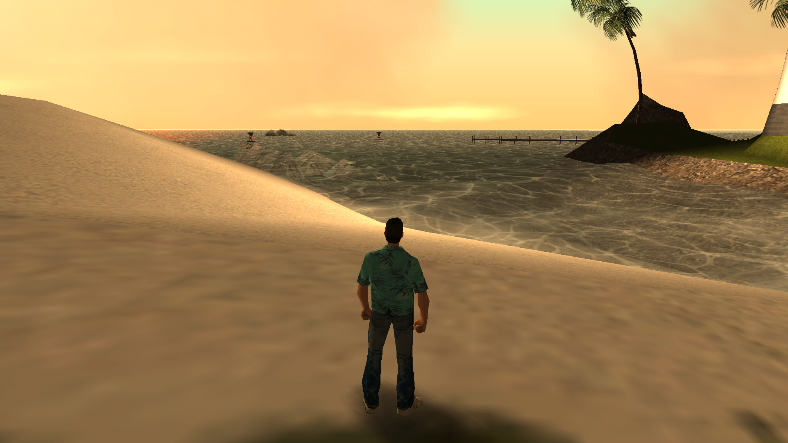
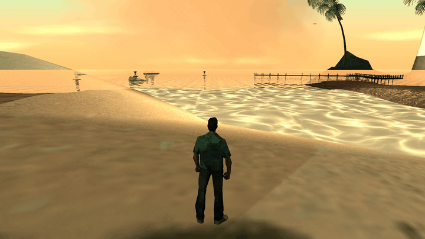

# reVC-RTGI

Real-time **ray traced global illumination** for [reVC](https://github.com/GTAmodding/re3)
(the GTA Vice City decompile). The original librw OpenGL renderer still draws
every frame; a Vulkan ray-query side-car (`VK_KHR_ray_query`) traces against the
live game world and composites the result back over the raster image through
GL/VK interop. It adds ambient occlusion, 2-bounce diffuse GI, ray traced sun
shadows, emissive neon/window lighting, headlight lights, and wet-road / sea
reflections — while leaving the game logic untouched. Everything is gated behind
the `RTGI` build flag and a runtime master toggle; with RTGI off the game renders
pixel-identical vanilla, which is exactly what makes the A/B shots below honest.

See **[RTGI.md](RTGI.md)** for the full architecture, the list of what's ray
traced, config keys, and tuned constants.

## Raster vs. ray traced

Identical camera, time of day, and weather in each row — left is stock reVC
(`enabled=0`), right is RTGI on. The ray-traced side is a short **live loop**
so you can see the dynamic behaviour a still can't show: traffic sweeping
through the wet-road reflections, rain, rippling water, neon bounce on moving
cars. Regenerate the whole set deterministically with
[`docs/comparisons/capture.ps1`](docs/comparisons/capture.ps1) (see
[docs/comparisons](docs/comparisons/README.md)).

<table>
  <tr>
    <th width="50%">Raster (original, still)</th>
    <th width="50%">Ray traced (live)</th>
  </tr>
  <tr><td colspan="2"><b>Rain, Ocean Drive</b> — wet asphalt mirrors palms, buildings and passing traffic</td></tr>
  <tr>
    <td></td>
    <td></td>
  </tr>
  <tr><td colspan="2"><b>Night, Ocean View neon</b> — emissive GI washes the street</td></tr>
  <tr>
    <td></td>
    <td></td>
  </tr>
  <tr><td colspan="2"><b>Noon, Ocean Drive</b> — daylight AO + sky GI</td></tr>
  <tr>
    <td></td>
    <td></td>
  </tr>
  <tr><td colspan="2"><b>Golden sunset, beach → skyline</b> — low-sun bounce</td></tr>
  <tr>
    <td></td>
    <td></td>
  </tr>
  <tr><td colspan="2"><b>Dawn, lighthouse channel</b> — sea reflections</td></tr>
  <tr>
    <td></td>
    <td></td>
  </tr>
</table>

## Requirements

- Windows x64
- An RTX-class NVIDIA GPU with a Vulkan driver (developed on an RTX 3090)
- A legitimate copy of GTA Vice City for the game assets (not included)

## Build

Clone with submodules (librw is vendored as a submodule — the RTGI fork carries a
one-line `im3dOverrideShader` hook, archived at
[`docs/librw-rtgi.patch`](docs/librw-rtgi.patch)):

```sh
git clone --recurse-submodules https://github.com/gonzaloberteri/reVC-RTGI.git
# or, in an existing clone:
git submodule update --init --recursive
```

Then generate the solution and build (details and toolchain notes in
[RTGI.md](RTGI.md#build)):

```sh
premake5 vs2019 --with-librw --with-rtgi
msbuild build/reVC.sln -p:Configuration=Release -p:Platform=win-amd64-librw_gl3_glfw-oal -p:PlatformToolset=v143
```

Without `--with-rtgi` the build is vanilla reVC. Runtime controls live in the
debug menu (Ctrl+M → RTGI) and, for automated runs, in `rtgi_config.txt` next to
the exe — both documented in [RTGI.md](RTGI.md#runtime-controls).

## Credits

Built on [re3 / reVC](https://github.com/GTAmodding/re3) by the GTAmodding team
and [librw](https://github.com/aap/librw) by aap. This repository only adds the
ray tracing side-car; all original reversing credit belongs upstream.
